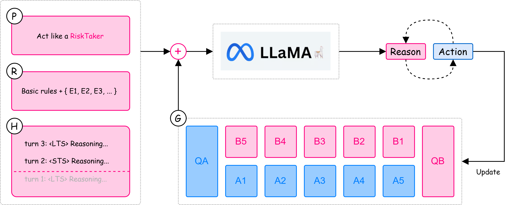

# Can LLMs Play Ô Ăn Quan? A Study of Multi-Step Planning and Decision Making

This repository contains a reference implementation of the Ô Ăn Quan
game environment and LLM-based agents used in our study.

## Abstract

In this paper, we explore the ability of large language models (LLMs) to plan and make decisions through the lens of the traditional Vietnamese board game, Ô Ăn Quan. This game, which involves a series of strategic token movements and captures, offers a unique environment for evaluating the decision-making and strategic capabilities of LLMs. Specifically, we develop various agent personas, ranging from aggressive to defensive, and employ the Ô Ăn Quan game as a testbed for assessing LLM performance across different strategies. Through experimentation with models like Llama-3.2-3B-Instruct, Llama-3.1-8B-Instruct, and Llama-3.3-70B-Instruct, we aim to understand how these models execute strategic decision-making, plan moves, and manage dynamic game states. The results will offer insights into the strengths and weaknesses of LLMs in terms of reasoning and strategy, contributing to a deeper understanding of their general capabilities.




## Project Structure

```
environment.py      # Game rules and state transition logic
agent.py           # LLM-based player agent
utils.py           # Logging and visualization utilities
```

## Usage

Before running the code, set up your OpenRouter API key and LangSmith API key
in an environment file, following the format in [example.env](example.env).

```python
python main.py # Demo with 5 rounds
```

Output: [log](logs/5-round.txt)


## Note

 ⚠️ In this LangChain-based implementation, we remove the dialogue history component and simplify both the agent persona design and game rules, in order to focus on core planning and decision-making behavior.

## Citation

If you use this code, please cite:

```
@inproceedings{nguyen2025can,
  title={Can LLMs Play {\^O} {\u{A}}n Quan? A Study of Multi-Step Planning and Decision Making},
  author={Nguyen, Sang Quang and Van Nguyen, Kiet and Nguyen, Vinh-Tiep and Ngo, Thanh Duc and Nguyen, Ngan Luu-Thuy and Le, Duy-Dinh},
  booktitle={2025 International Conference on Multimedia Analysis and Pattern Recognition (MAPR)},
  pages={1--6},
  year={2025},
  organization={IEEE}
}
```